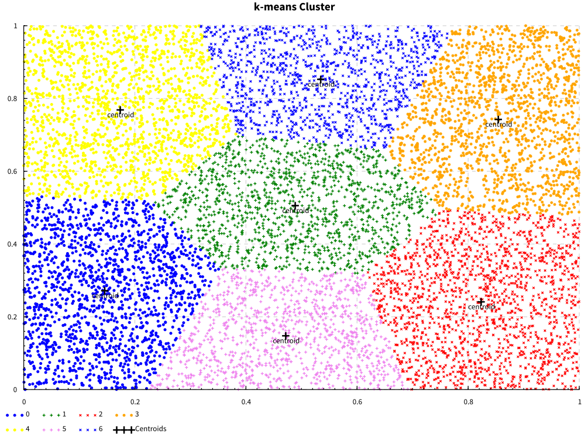

# K-Means Clustering Algorithm

The purpose of this project is to implement and optimize the _standard k-means clustering algorithm_ in Haskell. This is not a library, though it offers a nice API.

See the [report](./report.pdf) for a detailed description of this project.

## Introduction

`k-means clustering` algorithm aims to partition `n` observations into `k` clusters in which each observation belongs to the cluster with the `nearest mean` (cluster centers or cluster centroid), serving as a prototype of the cluster. This results in a partitioning of the data space into `Voronoi cells`. It is popular for cluster analysis in data mining.

## Complexity Cost

The total cost on d-dimensions is `O(t*n*k*d)-time`.

An in-depth analysis can be found [here](./complexity.txt).

## API

This project offers a simple API to use:

```haskell
import KMeans
import KMeans.Easy

newtype KMeans = KMeans { clusters :: Vector Cluster }

-- Use this if you want to discover the number of clusters
easy :: [Point] -> KMeans

-- Use this if you expect k clusters.
fit :: [Point] -> Int -> KMeans
```

and some nice plotting functions:

```haskell
-- Visual representation of the k-means clustering algorithm
scatter :: FilePath -> KMeans -> IO ()

-- Elbow plot of the Within-Cluster Squared Sum of Errors.
elbow :: FilePath -> [(Int, Double)] -> IO ()
```

The result of the `scatter` plot is the following one:



## Project Structure

The project is divided in the following folders:

- app: example application using the KMeans library.
- bench: benchmark executable and an output example of it.
- doc: latex report (the code is also documented).
- img: pictures of the generated plots.
- nix: nix related files.
- profile: executables to be runned in GHC's `prof` mode.
- src: library sources.
- test: test sources (not implemented).

## Development

Run `nix-shell` on the root directory to enter into a shell environment with all dependencies.

Afterwards, you can write your usual `cabal` commands to compile and run the project.

To produce an optimized binary, run `nix-build` on the root directory.

## FAQ

- Why is the library only working with two dimensional points ?

The idea behind this project was to create a nice and rich API for the public use but a fast implementation of the algorithm for academic purposes.

- Why are there two versions of the KMeans ?

As I stated

## Future Work

Use `Data.Vector.Unboxed` and flatten the `KMeans` data structure (requires quite a refactor).

Implement a faster k-means Clustering Algorithm: <https://annals-csis.org/proceedings/2014/pliks/258.pdf>
